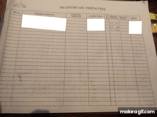
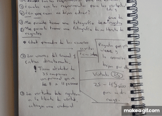
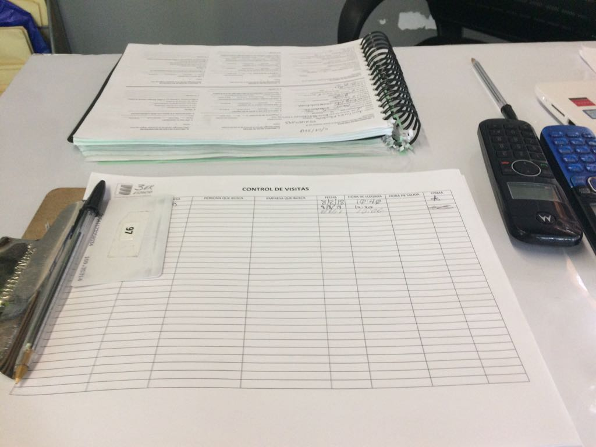
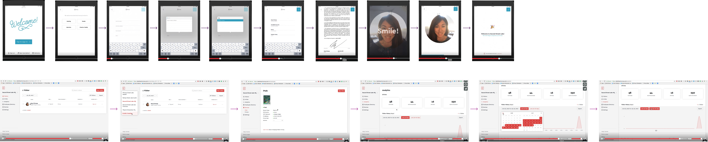
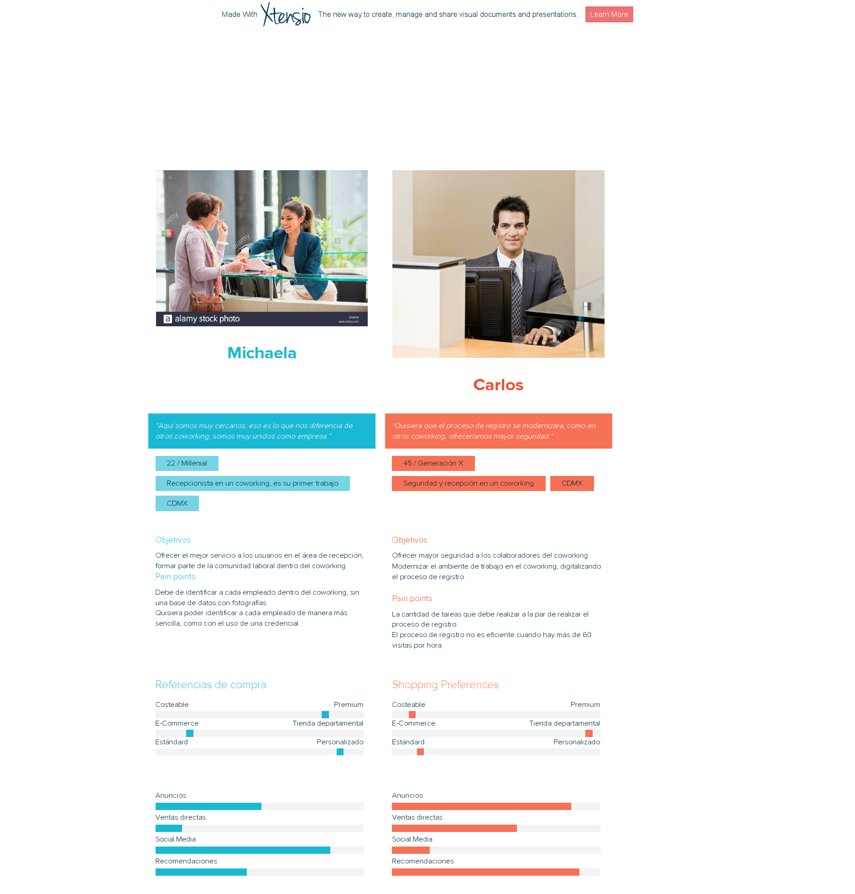
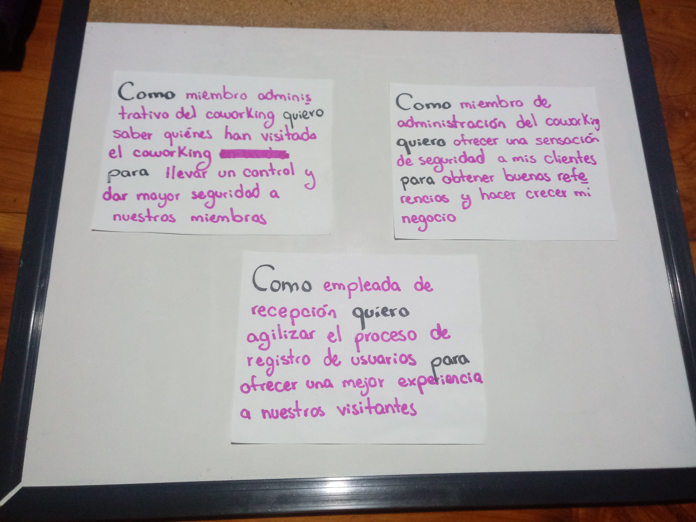
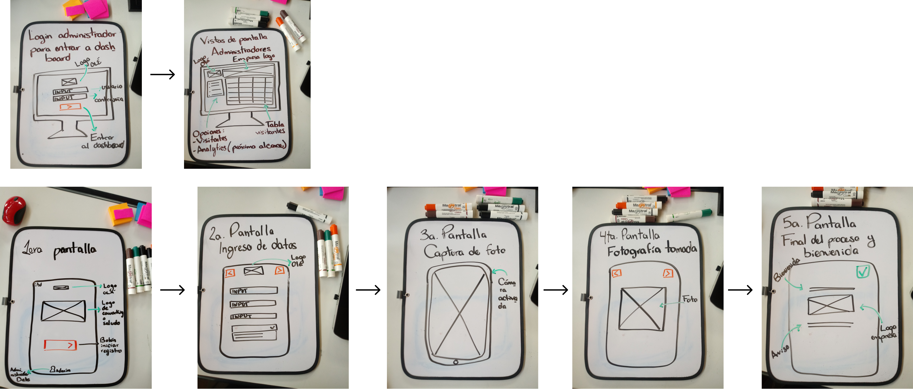

# :wave: Olá. Registro de usuarios para coworking

## :clipboard: Contexto

Actualmente operan cerca de 74 espacios de coworking en México, han ganado la 
preferencia de los emprendedores ya que les permite hacer negocios de manera 
más eficiente y representa una opción más accesible económicamente. Esto ha 
detonado una expansión acelerada de espacios de coworking en México durante 
los últimos dos años.

De acuerdo con un estudio realizado por la consultora internacional HOK, México 
es el sexto mercado en desarrollo más importante en cuanto al crecimiento 
de espacios de coworking se refiere, al superar a países como Francia e Italia, 
pero por debajo de Brasil e India. 

Se calcula que a nivel mundial este negocio tiene un valor de casi 15 mil millones 
de dólares, por lo que la oportunidad para esta industria es enorme. Las micro empresas 
mexicanas suman 3.9 millones y representan 97% del ecosistema en México, de acuerdo 
con el Instituto Nacional de Estadística y Geografía (Inegi).  

## :x: El problema 

* Nuesto equipo fue encomendado con la tarea de crear un registro de usuarios diseñado 
para un espacio de coworking. 
* Tiempo disponible: 1 semana.

### :dart: Conocimiento y delimitación del problema 

Decidimos dirigimos a 4 espacios distintos, con la intención de conocer los problemas 
específicos que se encuentran en la experiencia de ingreso a un coworking en la
Ciudad de México.  

Para tener un mejor entendimiento del proceso de registro existente y los usuarios 
que realizan este proceso visitamos los espacios de coworking que describimos a continuación, 
en los cuales llevamos a cabo entrevistas con el personal de recepción de cada espacio.

*Por motivos de seguridad decidimos sustituir los nombres de los coworkings visitados*
*por letras "A,B,C,D" para así mantener la confidencialidad. De igual manera tomamos*
*la decisión de guardar los audios citados, transcripciones y fotografías de cada visita*
*en Google Drive, por lo que, para poder escucharlos pedimos que soliciten hacerlo por ese medio.*

#### :page_facing_up: Guía de entrevista 

Antes de nuestras visitas a los distintos coworks elaboramos una guía de entrevista:

* ¿Cómo es el proceso de ingreso al coworking?
* ¿Quiénes están involucrados?
* ¿Cuál es el proceso para empleados/colaboradores y para visitantes?
* ¿Qué cambios le harías al proceso que llevan a cabo en la actualidad?
* Problemas con los que se encuentran durante el proceso de registro
* ¿Alguna empresa pide algún otro requisito para poder ingresar a su espacio?
* ¿Has recibido comentarios sobre el proceso de ingreso?
* En caso de contar con un registro digital ¿cuál es su interfaz? ¿cuál es el user flow?
* Edad promedio de los visitantes
* Número promedio de visitantes

[Transcripción de las entrevistas a los espacios de coworking "A" "B" "C" y "D"](https://drive.google.com/drive/folders/1ocgHERLB35E4b09Q7KZS7mcEPTufXOJD?usp=sharing)

#### :information_desk_person: Verbalizaciones obtenidas coworking "A":
- “Tenemos una agenda, una lista en la que ya tenemos a los clientes frecuentes y 
  dependiendo de esa lista uno ya con el tiempo lo va ubicando, y cuando son empresas 
  nuevas se les pide su registro y nada más cuando vayan llegando se les pide su hora 
  de entrada, su hora de salida, para tener un control sobre las personas y los que 
  se encuentran en un cowork en el edificio.”
- “Cuando ya se tiene una noción de quiénes son las personas que entran al edificio 
  ya no es tan necesario [refiriéndose a la hoja de registro en el área de recepción], 
  pero de mi parte sí es necesario ubicarlos para tener el control del edificio.”
- “Cuando yo entré no conocía a todas las empresas, al principio sí se me hizo muy 
  complicado y obviamente los empiezas a ubicar (...)”
- [Sobre tener una tableta en recepción con un software que le permita a las personas 
  hacer su registro de ingreso] “Yo considero que no sería tanto trabajo para mí, sería 
  más sencillo, pero sería más...no sería necesario mi trabajo ¿no crees?”
- “Yo cambiaría a lo mejor darles identificaciones, donde vengan empresas, nombre y 
  a lo mejor un número para tener un registro más elaborado, creo que sería lo único.”
- [Sobre cómo identificar a los visitantes] “No les pedimos identificación, ya 
  posteriormente cambiándonos de edificio lo más probable es que sí se comience a 
  pedir identificación, más que nada para tener el control porque sería un piso más 
  grande, entonces entrarían aún más personas.”
- [Sobre cómo comunican si un visitante puede ingresar al edificio o no] “Es por 
  grupos, todo es por grupos de Whatsapp, obviamente entre empresas ya es diferente 
  la comunicación, porque es con Whatsapp Bussiness (...) De mí a otras empresas sí 
  es por Whatsapp o correos.”
- [Sobre un sistema de ingreso ideal] “A mi me gustaría que fuera como en las 
  escuelas supongamos, ves que te dan tu credencial, la pasas, ya tienes como vino 
  a tal hora, tal día, y ya, pero bueno pasa lo mismo, sería como mínimo mi trabajo 
  que yo haría. Sería como mejor, pero unas por otras.”

#### :ear: Insights obtenidas coworking "A":
* El proceso de ingreso no se encuentra totalmente digitalizado. 
* El cowork está en proceso de expansión, al tener un espacio mayor con más visitantes
  notan que el método de ingreso es un área de mejora. 
* El factor humano es un valor que este coworking aprecia como parte de la experiencia 
  de ingreso de sus visitantes. 
* En caso de cambio de personal el proceso de cambio podría ser complicado al inicio,       
  ya que el proceso de ingreso y registro no se encuentra digitalizado y aun dependen
  mucho del conocimiento personal del área de recepción.  
* Están abiertos a la digitalización del proceso, mientras se conserve el factor humano
  en el proceso de registro. 

#### :man: Sobre la entrevista con el coworking "B":
Durante la entrevista, la encargada me comentó que les era muy importante que hubiera 
personas que recibieran a la gente en la puerta, que uno de los mayores valores que ofrecen 
como coworking es la seguridad de las personas que trabajan en él y eso lo hacen notar 
desde el proceso de registro con la atención del personal de recepción. Me comentó que 
trabajan con Envoy, hace unos meses que han comenzado a usarlo, pero el cambio aún no es 
definitivo como lo es en otras sucursales, donde toman fotografía de los visitantes y 
entregan credenciales que pasan por un torniquete al entrar y salir. Será en octubre, 
cuando Laboratoria ocupe uno de los pisos que habrán implementado Envoy y el sistema de 
torniquetes ya que, como me comentó, la entrada y salida de personas será mayor y tendrán 
que tener un mayor control.  

#### :ear: Insights obtenidas coworking "B":
* El coworking valora la seguridad que ofrece a sus colaboradores, por lo que
  contar con personal de seguridad en la entrada es primordial, aunque su 
  proceso de registro esté, en su mayor parte, digitalizado. 
* Envoy les ha resultado muy útil ya que la mayor parte del proceso se realiza
  de manera automática, pero están abiertos a conocer nuevas opciones, especialmente
  si provienen de desarrolladoras de Laboratoria. 
* El personal de recepción es quien hace uso de la herramienta de registro, no 
  reciben capacitación alguna y quisieran poder conocer más sobre el proceso.
* Al personal de recepción puede parecerle complicado el manejo de esta herramienta, 
  dependiendo del nivel de conocimiento tecnológico que posean. 

#### :man: Sobre la entrevista con el coworking "C":
- Requerimientos de registro para los usuarios colaboradores del coworking: 
  Ninguno, dado que son colaboradores entran de manera directa.
- Edad promedio de los usuarios: Entre 25 a 45 años.
- Número aproximado de visitas por día: Más de 25 visitas.
- Requerimientos  de registro para los visitantes: 
  Deben registrarse en un libro de visitas, ingresando los siguientes datos: 
  fecha de entrada, nombre completo, a quién se visita, asunto de la visita, 
  hora de entrada y hora de salida. 
  También se le solicita una credencial de elector, de la cual se verifica 
  que el nombre y la foto corresponda con los del usuario que se está registrando.
  Después de que el usuario se registra se le anuncia a la persona visitada que 
  su visita llegó, para que salga al área de recepción a recibirle.
  Existen casos en los que no se deja entrar a alguna visita, como cuando la persona 
  a quien se visita (o su empresa) confirma que no conoce a la visita y por lo tanto 
  no puede recibirla. 

#### :ear: Insights obtenidas coworking "C":
* El proceso de registro de usuario no está digitalizado.
* El personal de recepción no se limita a esta área, por lo que también llevan a cabo 
  tareas en otras áreas del coworking.
* El personal de recepción identifica la necesidad de digitalizar y modernizar el proceso
  de registro, creen que daría una mejor imagen al coworking, ya que otros espacios
  cuentan con este servicio. 
* Este coworking valora el factor humano, ya que les parece primordial para brindar más
  seguridad a sus clientes. 

#### :information_desk_person: Sobre la entrevista con el coworking "D":
- Sus usuarios son jóvenes entre los 24 y 35 años.
- El proceso de registro toma un minuto, no solicitan identificación y 
  la información que solicitan en su formato es el nombre y el horario de 
  entrada y salida.
- Es el coworking más pequeño de los que visitamos, su proceso no se 
  encuentra digitalizado.

#### :ear: Insights obtenidas coworking "D":
* El proceso de registro es percibido por el personal de recepción como 
  tedioso y obsoleto. La información que se escribe en el libro de registro 
  se lleva a un Excel para procesarla. Por lo que implica más trabajo con 
  los mismos datos.
* Desean automatizar el proceso para poder ligarlo con otros aspectos 
  como el cobro del espacio de acuerdo al tiempo de uso por cliente.
* No cuentan con los filtros de seguridad que encontramos en otros espacios,
  el acceso fue más sencillo y tomó menos tiempo. 

## :chart_with_downwards_trend: Benchmark 

## :woman::man: Personas

El acercamiento por medio de entrevistas a los diferentes espacios de 
coworking nos llevo a generar las personas que presentamos. Las tuvimos en
mente al generar nuestra solución. 

Creemos que el coworking se centra en la creación de un espacio que fomente la 
colaboración, el compartir conocimientos, la **innovación y la experiencia de usuario**. 

## :star: Épicas

## :bar_chart: Historias de usuario

## :art: Proceso de diseño 

### :pencil2: Wireframe

### :iphone: Mockup

### :point_right: Prototipo clickable 

## :two_women_holding_hands: :computer: User testing

### :green_book: Bibliografía

[¿Cuál es el siguiente nivel de coworking?.Forbes](https://www.forbes.com.mx/cual-es-el-siguiente-nivel-de-coworking/)

[Millenials generan oleada de coworkings.El Financiero](http://www.elfinanciero.com.mx/empresas/millennials-generan-oleada-de-coworkings)

[Guía Forbes de Coworking: todo lo que necesitas saber](https://www.forbes.com.mx/guia-forbes-de-coworking-todo-lo-que-necesitas-saber/)

[El estilo WeWork](https://www.forbes.com.mx/el-estilo-we-work/)

[Whatsapp Bussiness](https://www.whatsapp.com/business/)

[Whatsapp Bussiness en México](https://www.forbes.com.mx/whatsapp-business-llega-a-mexico-ya-disponible/)

[Cómo funciona Whatsapp Bussiness](https://www.xatakamovil.com/aplicaciones/asi-funciona-whatsapp-business-la-aplicacion-de-mensajeria-instantanea-para-empresas)
